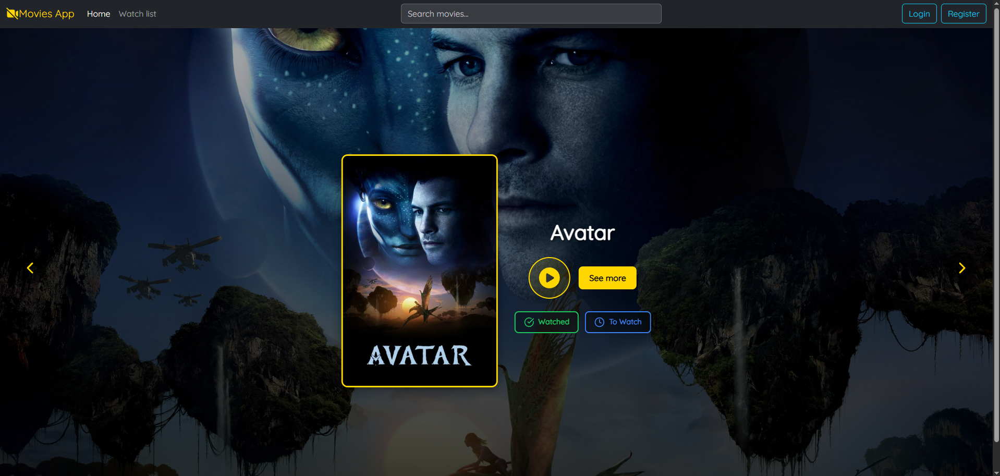
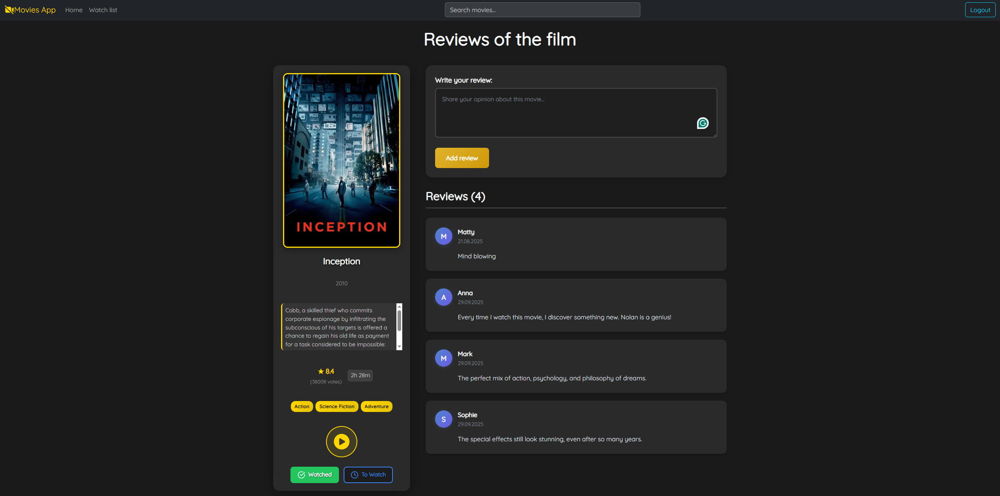
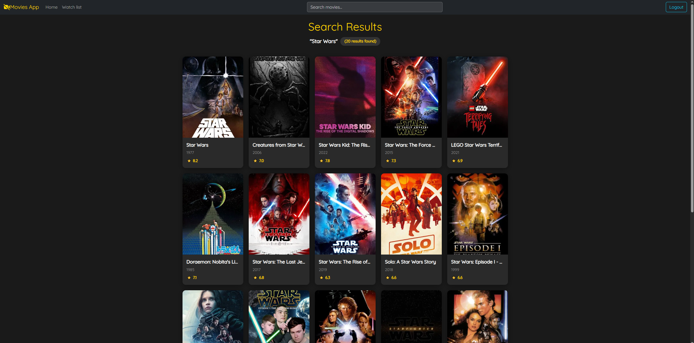
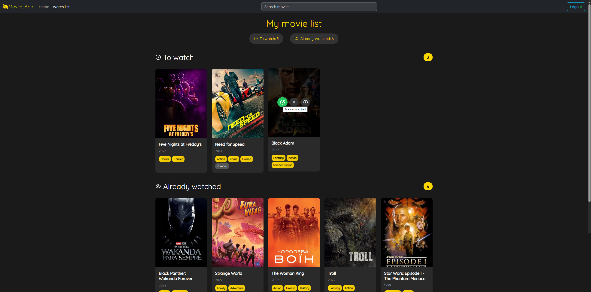
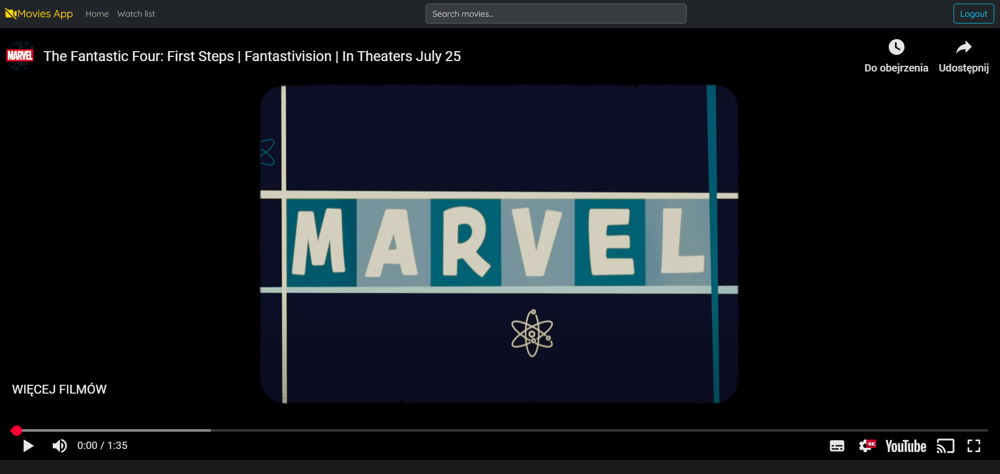
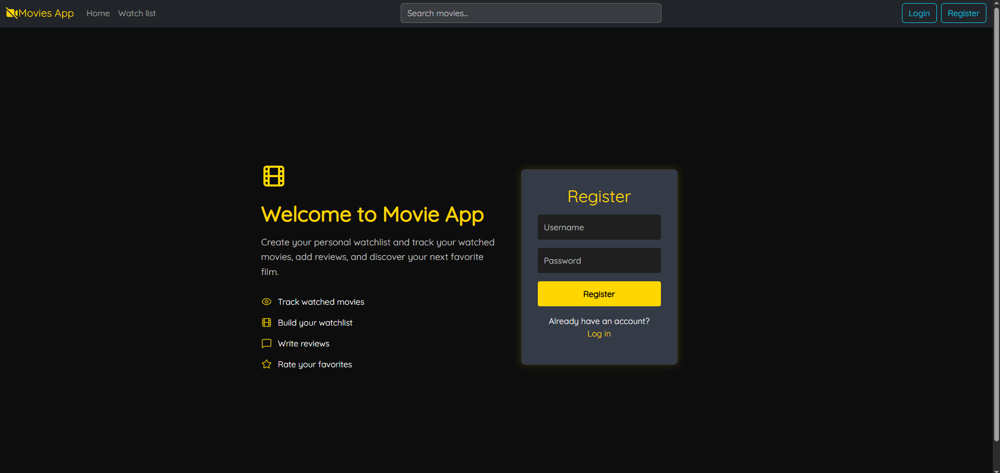

# Movie Platform

Movie Platform is a web application for exploring and managing movies. It integrates with TMDB API to provide up-to-date movie data and allows users to review, save, and organize films.

## 🔑 Main Features
- **Search movies** – powered by TMDB API.
- **Movie details** – view description, rating, runtime, and release date.
- **Reviews** – write and share movie reviews. A movie is stored in the database only when a review is added or the user saves it to a list.
- **Watch list** – save movies to your “To Watch” or “Already Watched” lists.
- **Trailers** – watch official trailers directly on the platform.
- **User authentication** – sign up and log in to access personalized features.

## 🚀 Technologies
- Spring Boot 3.x  
- Spring Security + JWT  
- PostgreSQL 
- Spring Data JPA
- React 19
- OpenAPI/Swagger  

## 📚 API Documentation

Full API documentation is available in Swagger UI once the application is running:

**URL:** `http://localhost:8080/swagger-ui/index.html`

The documentation includes:  
- All endpoints
- Request/response schemas  
- Ability to test endpoints directly in the browser  
- JWT Bearer Token support  

### Authorization in Swagger

For endpoints requiring authorization:  
1. Log in using the `/api/v1/auth/login` endpoint  
2. Copy the returned token  
3. Click the **"Authorize"** button in Swagger UI  
4. Paste the token (without the `Bearer` prefix)  
5. Click **"Authorize"**  

