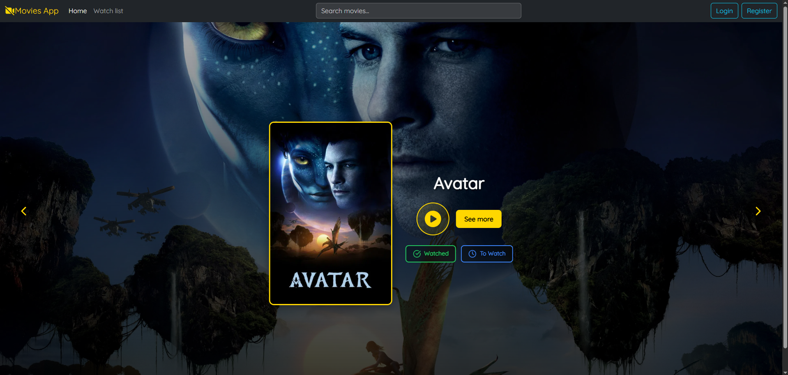
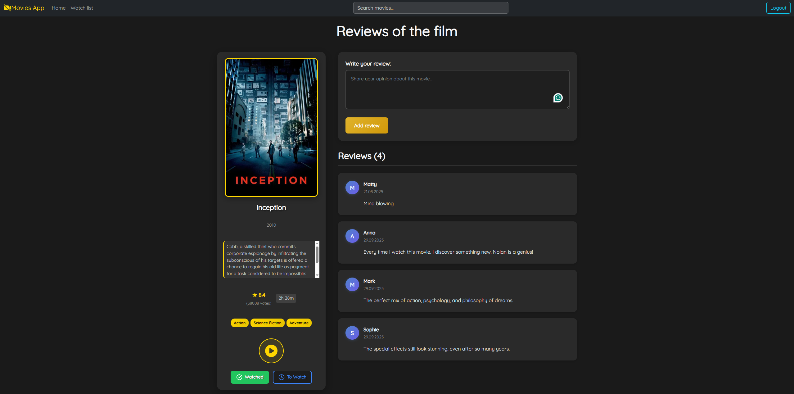
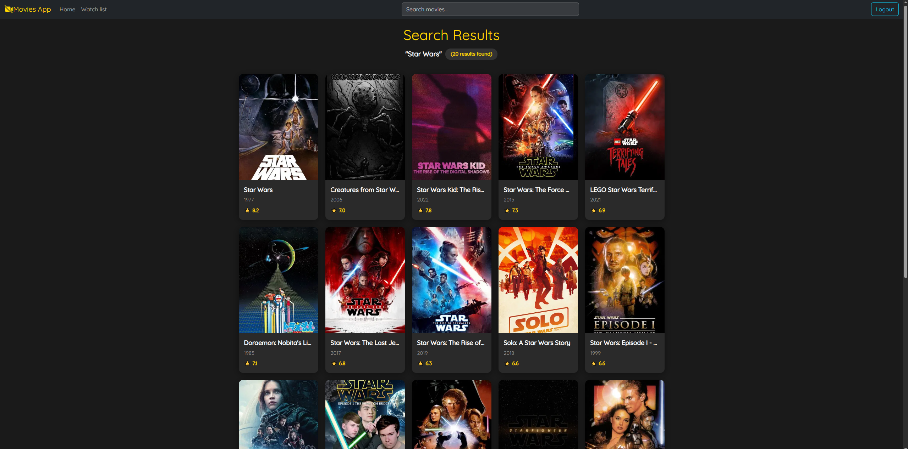
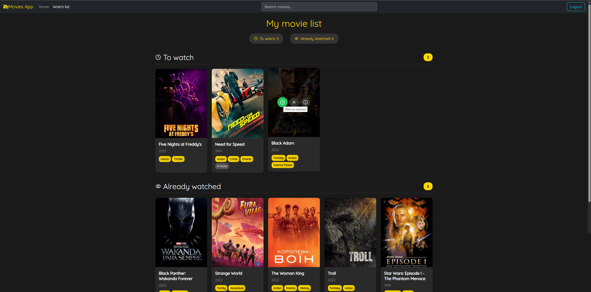
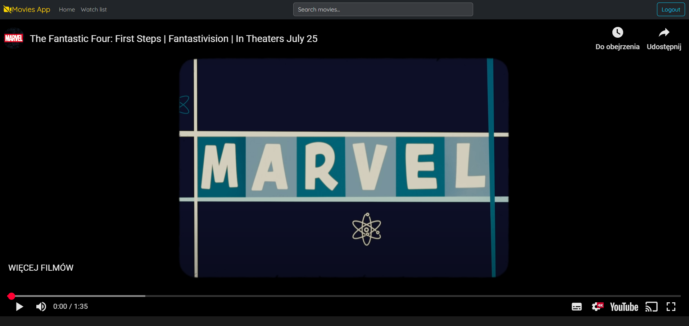
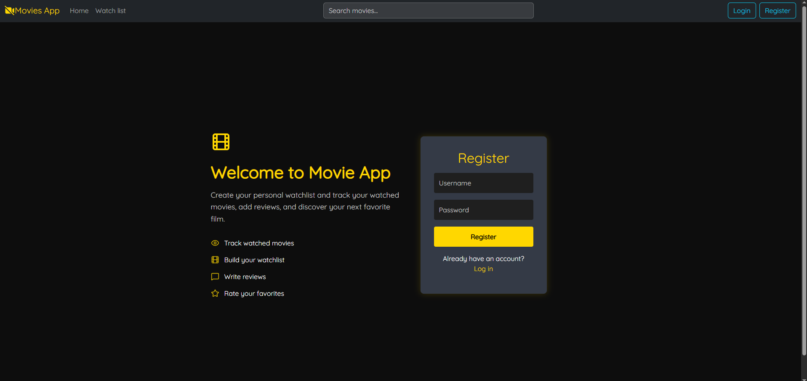

# Movie Platform

Movie Platform is a web application for exploring and managing movies. It integrates with TMDB API to provide up-to-date movie data and allows users to review, save, and organize films.








## Installation & Setup (Quick Start)

You can run the entire application (Frontend + Backend + Database) with a single command using Docker.

### Prerequisites
* Docker & Docker Compose installed.
* git

### Step-by-Step Guide

**1. Clone the repository**
```bash
git clone <your-repo-url>
cd <your-project-folder>
```
**2. Configure Environment (Crucial for Movie Data)**

The project includes a default configuration for a quick start. However, to fetch real movie data, you need a TMDB API Key.

* Copy the example environment file:
```bash
cp .env.example .env
```
*(Windows CMD users: `copy .env.example .env`)*

* Open the newly created `.env` file and paste your key:
```ini
TMDB_API_KEY=your_actual_api_key_here
```

> **Important Note:** If you skip this step or do not provide a valid API Key, the application will still launch successfully (using fallback defaults), but movie lists will be empty and external API requests will fail.

**3. Run the Application**

Build and start the containers:
```bash
docker-compose up --build
```
Please wait a few minutes for the initial build (Maven dependencies & Node modules).

**4. Access the App**

Once the logs settle, the application is available at:

| Service | URL | Default Credentials |
|:---|:---|:---|
| Frontend | http://localhost:3000 | Register with username & password to access all features |
| Swagger UI | http://localhost:8080/swagger-ui/index.html | — |
| Adminer (DB) | http://localhost:8088 | System: `PostgreSQL`, Server: `moviesdb`, User: `username`, Pass: `password` |

---

## Main Features
- **Search movies** – powered by TMDB API.
- **Movie details** – view description, rating, runtime, and release date.
- **Reviews** – write and share movie reviews. A movie is stored in the database only when a review is added or the user saves it to a list.
- **Watch list** – save movies to your “To Watch” or “Already Watched” lists.
- **Trailers** – watch official trailers directly on the platform.
- **User authentication** – sign up and log in to access personalized features.

## Technologies
- Spring Boot 3.x  
- Spring Security + JWT  
- PostgreSQL 
- Spring Data JPA
- React 19
- OpenAPI/Swagger  

## API Documentation

Full API documentation is available in Swagger UI once the application is running:

**URL:** `http://localhost:8080/swagger-ui/index.html`

The documentation includes:  
- All endpoints
- Request/response schemas  
- Ability to test endpoints directly in the browser  
- JWT Bearer Token support  

### Authorization in Swagger

For endpoints requiring authorization:  
1. Log in using the `/api/v1/auth/login` endpoint  
2. Copy the returned token  
3. Click the **"Authorize"** button in Swagger UI  
4. Paste the token (without the `Bearer` prefix)  
5. Click **"Authorize"**  

